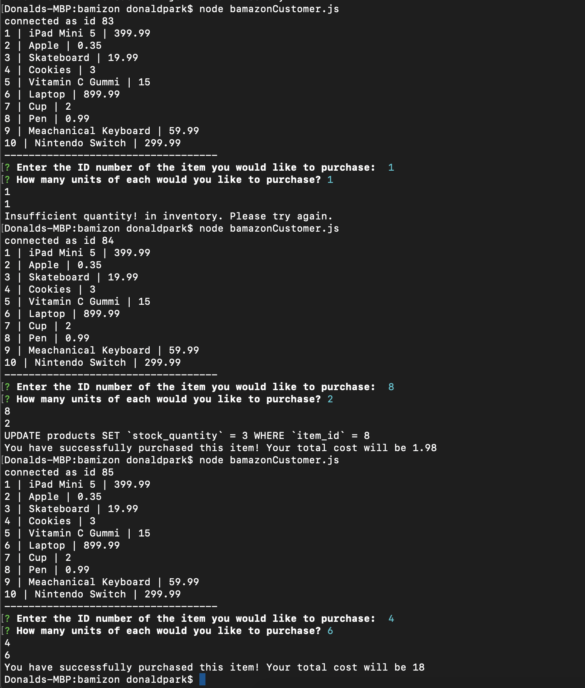

# bamizon

This app demonstrates a store for users to access and purchase items. The database will be compared to the prompts the user is given and then the database's inventory of the item sold is updated after the user makes a purchase.

## Codes Used
Make sure to install important npm packages in order for the code to work: 'npm i inquirer' and 'npm i mysql'

####Example of how the code works
